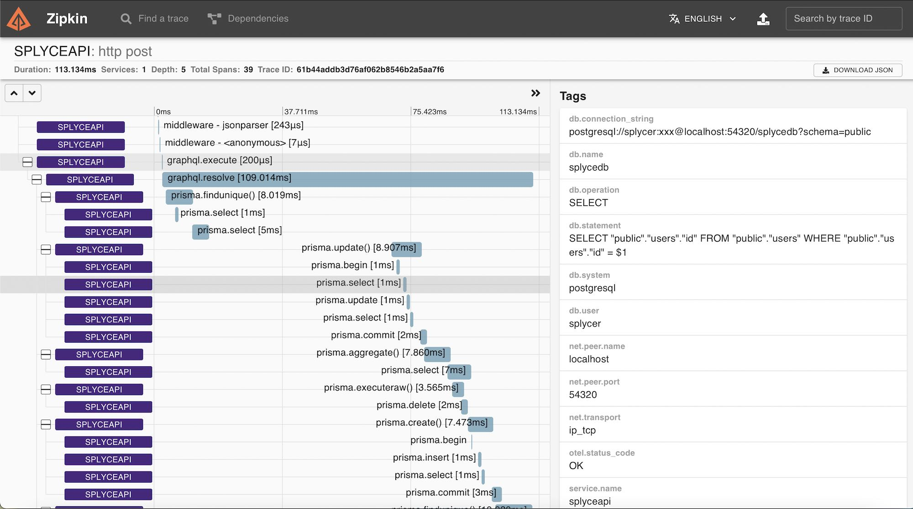

# instrumentation-prisma
OpenTelemetry instrumentation for Prisma ORM

This is a really crude OpenTelemetry instrumentation plugin for Prisma ORM.  Note this is PostgreSQL specific, though it would be pretty trivial to adapt to MySQL.

A good instrumenter for Node would probably derive from the @opentelemetry/instrumentation InstrumentationBase class and support patching the instrumented packages functions, etc. That is hard to do with Prisma since it has a binary engine executing statements and isn't using the pg packages, so this simple instrumenter uses Prisma's $use() middleware hook and the $on() event listener.

A few issues with this approach:

1. $use() only wraps the Prisma high level methods, so you don't get much of an idea of what the engine is doing with actual SQL queries.
2. $on('query') is called after the query completes - probably after the $use() middleware function has returned - so the context handling for a child span is pretty weird. I just store the context in an instance variable.  Not sure what will happen under actual load.
3. Also, the timestamp and duration of the event from $on() is in milliseconds, so it's a bit less precise than desired (but that's a bit of a nitpick I guess).

To use it, you can do something like this when setting up your tracing:
  
    import { PrismaInstrumentation } from './instrumentaton-prisma'
    import prisma from './db'
    
    ...
    
    registerInstrumentations({
      tracerProvider: provider,
      instrumentations: [
        new HttpInstrumentation,
        new ExpressInstrumentation,
        new GraphQLInstrumentation,
        new PrismaInstrumentation({
          prisma,
        })
      ],
    });

Improvements
------------
The biggest issue right now is that there is no way to actually correlate the $on('query') events to this 'parent' span createde in the $use() middleware.  It would be great to be able to pass a UUID in $use() to next and get it in the $on() callback, or even better just have both callbacks provide a shared unique query ID in their parameters - if either of those were present I could at least use a slightly less hacky LRU cache to store Contexts.

Also, of course, adding MySQL support would be nice, and probably really easy as it would be mostly (entirely?) cosmetic (DB connection info).

And looking at the below capture, some of the start/stop times of the SQL traces seem a bit questionable.  They are based on the timestamps that come from Prisma (not the OpenTelemetry code, since it's not wrapped, it's a callback) so there isn't much I can do there.

Gratuitous Screencap
------------

